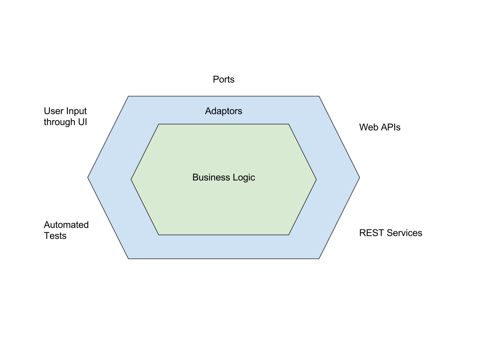

## Redux: The Angular Way

---

### Goals 

- Write more maintainable Angular code
- Insulate yourself from your dependencies
- Write more pure functions

---

### Warning!!

- This might feel like a lot of boilerplate and overkill
- It _is_ for small applications
- The least boilerplate while still paying dividends at scale

---

### What’s the Real Purpose of the App?

- Not to write an Angular application specifically
- To solve a problem and provide value

---

### Architecture Pattern - Ports and Adaptors

- Also called Hexagonal Architecture
- Creates boundaries (adaptors) between your application and it's dependencies (ports)
- Contains Primary Actors (UI), Secondary Actors (REST Services), and the core of your application (Business Logic)

---

### Hexagonal Architecture



---

### Angular is just another thing to consume

- Angular is just a large collection of Ports
- You could swap it out and still solve the same business problem

---

### How does Functional Programming fit in?

- Problem: Angular is inherently very class based
- Functional Programming naturally falls into Ports and Adaptors

---

### Functional Architecture


---

### The Pure Application Core

- Redux _is_ your application
  - Epics are impure, but you have to put the side effects somewhere
- Actions are your Primary Adaptors
- API calls triggered by Epics are your Secondary Adaptors
- Write using your own DSL

---

### The Impure Edges

- Keep it as thin as possible
- Write small wrappers around library code
- Translate between your own DSL and the requirements of your dependency

---

_Thin Wrapper around @angular-redux/store_
```typescript
@Injectable()
export class StateStore {
  constructor(private ngRedux: NgRedux<AppState>) {}

  getState<S>(selector: Selector<S>): Observable<S> {
    return this.ngRedux.select<S>(selector);
  }

  performAction(action: Action<any, any>) {
    this.ngRedux.dispatch(action);
  }
}
```

---

_Thin Wrapper around LocalStorage_
```typescript
@Injectable()
export class StorageService {

  constructor(@Inject(LOCAL_STORAGE) private storage: Storage) {}

  clear() {
    this.storage.clear();
  }

  getItem<T>(key: string): T {
    try {
      return JSON.parse(this.storage.getItem(key)) as T;
    } catch (error) {
      console.warn(
        `Failed to get item from local storage:`,
        error,
      );
    }
  }
}
```

---

_API Service_
```typescript
@Injectable()
export class AirportApi {

  constructor(private http: HttpService) {}

  loadNearestAirport(position: Position): Observable<Airport> {
    const radius = 100;
    const requestOptions = {
      params: {
        longitude: position.coords.longitude,
        latitude: position.coords.latitude,
        radius,
      },
    };
    return this.http
      .get<NearbyAirportsResponse>(this.nearbyAirportsUrl, requestOptions)
      .map(filterNearestAirport);
  }
}
```

---

### Components

- Do not do data calculations or manipulations
- Extract it all into Redux
- Should be as thin as possible. Selectors in, Actions out.

---

_Example Component_
```typescript
export class LoginComponent implements OnInit {
  @ViewChild(NgForm) form: NgForm;

  usernameErrors: Observable<ValidationErrors>;
  passwordErrors: Observable<ValidationErrors>;
  loading: Observable<boolean>;
  errorMessage: Observable<string>;

  constructor(private store: StateStore) {}

  ngOnInit() {
    this.usernameErrors = this.store.getState(LoginFormSelectors.usernameErrors);
    this.passwordErrors = this.store.getState(LoginFormSelectors.passwordErrors);
    this.loading = this.store.getState(AuthSelectors.loginIsPending);
    this.errorMessage = this.store.getState(AuthSelectors.loginErrorMessage);
  }

  login() {
    const { email, password } = this.form.value;
    this.store.performAction(AuthActions.loginUser(email, password));
  }
}
```

---

### Actions

- Export pure functions
- Don't create a class wrapper that also dispatches the actions
- Flux Standard Actions (type, payload, error, metadata)

---

_Action Creator_
```typescript
export const LOGIN_USER = 'AUTH--LOGIN_USER';

export function loginUser(
  email: string,
  password: string,
): Action<LoginCredentials> {
  return {
    type: LOGIN_USER,
    payload: { email, password },
  };
}
```

---

### Reducers

- Export pure functions
- Standard Reducer best practices
  - Keep the state tree as flat as possible
  - Don't store anything that can be calculated / derived
  - Use types to describe your state tree
- Each leaf node of the tree should have a reducer function
  - Don't manipulate multiple parts of the state inside one reducer

---

### Selectors

- Export pure functions
- Don't create a class wrapper that selects from the store and returns Observables
- Make many small functions for easier composition
- As soon as you need to calculate/transform a value, use `createSelector` from `reselect`

---

### Epics

- Used for asynchronous actions as well as side effect orchestration
- Should read as a pipeline of named functions
- Remove as much detail into other functions as possible
- Have an epic not return an action with `.ignoreElements()`

---

_API call Epic_
```typescript
login: Epic<Action<LoginCredentials>> = actions =>
  actions
    .ofType(AuthActions.LOGIN_USER)
    .switchMap(({ payload }) =>
      this.authApi
        .login(payload.email, payload.password)
        .map(AuthActions.userLoggedIn)
        .catch(epicActionError(AuthActions.USER_LOGGED_IN)),
    );
```

---

_Side Effect Epic_
```typescript
logRouteChanges: Epic<Action<string>> = actions =>
  actions
    .ofType(UPDATE_LOCATION)
    .do(() => this.analyticsService.trackPageView())
    .ignoreElements();
```

---

### API Error State

- Normalize it into one part of the store
- Utilize a map between pending and resolved states
- Use the `error` flag from FSA to differentiate resolved states
- Able to select global or specific error states

---

```typescript
export const apiReducer = combineReducers<ApiState>({
  pending,
  errors,
});

function pending(state = initialState.pending, action: Action): Action[] {
  if (isPendingAction(action.type)) {
    return [...state, action];
  }

  if (isResolutionAction(action.type)) {
    return state.filter(removePendingAction(action.type));
  }

  return state;
}

function errors(
  state = initialState.errors,
  action: Action<ApiError>,
): Action<ApiError>[] {
  if (action.error) {
    return [...state, action];
  }

  if (isPendingAction(action.type)) {
    return state.filter(removeErrorAction(action.type));
  }

  return state;
}
```

---

### Forms

- Template based forms
- `@angular-redux/form` to keep form state in sync with store

---

### Form Validation

- Use selectors to create a `ValidationErrors` object (`[key: string]: ErrorMessage`)
- Use a custom directive to set the error state of the control
- Use higher order selectors to set up the rules

---

_Required Validation Selector_
```typescript
export const isRequired = (stateSelector: Selector<any>): ValidationSelector =>
  createSelector(
    stateSelector,
    state =>
      isValid(state) ? null : { required: `Field is required.` },
  );

function isValid(value: any): boolean {
  return !isEmpty(value) && !isNil(value);
}
```

---

_Field Selector_
```typescript
export const firstNameErrors = createSelector(
  isRequired(firstName),
  overrideErrorMessage(
    isMaxLength(firstName, 30),
    'Please enter a first name between 1 and 30 characters',
  ),
  overrideErrorMessage(
    validName(firstName),
    'First Name contains invalid characters',
  ),
  combineValidationErrors,
);
```

---

_Form Component Template_
```html
<form [connect]="['forms', 'register']" (ngSubmit)="register()" #form="ngForm">
  <input name="firstName" ngModel [controlIsValid]="firstNameErrors">
  <input name="lastName" ngModel [controlIsValid]="lastNameErrors">

  <button [disabled]="form.invalid">Submit</button>
</form>
```

---

### BONUS: Template Form Sub Component

- Able to create components that wrap reusable form sections
- Will auto-register with the parent `<form>` tag
- Have to write a little bit of hookup / tear-down glue

---

_Component Template_
```html
<ng-container ngForm>
  <fieldset ngModelGroup="address">
    <legend>Address</legend>
    <label>
      Street
      <input name="street" ngModel>
    </label>

    <label>
      City
      <input name="city" ngModel>
    </label>

    <label>
      Country
      <input name="country" ngModel>
    </label>
  </fieldset>
</ng-container>
```

---

_Component Class_
```typescript
export class AddressFormComponent {
  @ViewChild(NgModelGroup) modelGroup;
  @ViewChildren(NgControl) controls;
  
  constructor(@SkipSelf() private ngForm: NgForm) { }
  
  ngAfterViewInit() {
    this.ngForm.addFormGroup(this.modelGroup);
    this.controls.toArray().forEach(c => this.ngForm.addControl(c));
  }
  
  ngOnDestroy() {
    this.ngForm.removeFormGroup(this.modelGroup);
  }
}
```

---

_fin_
